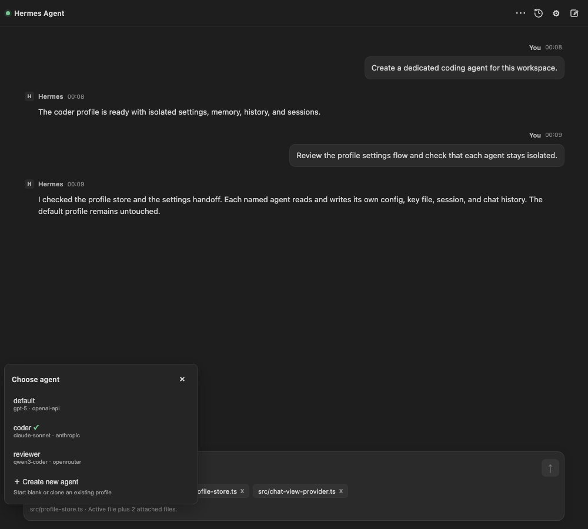
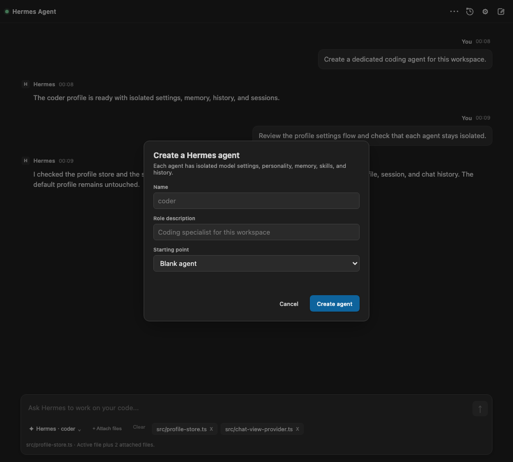
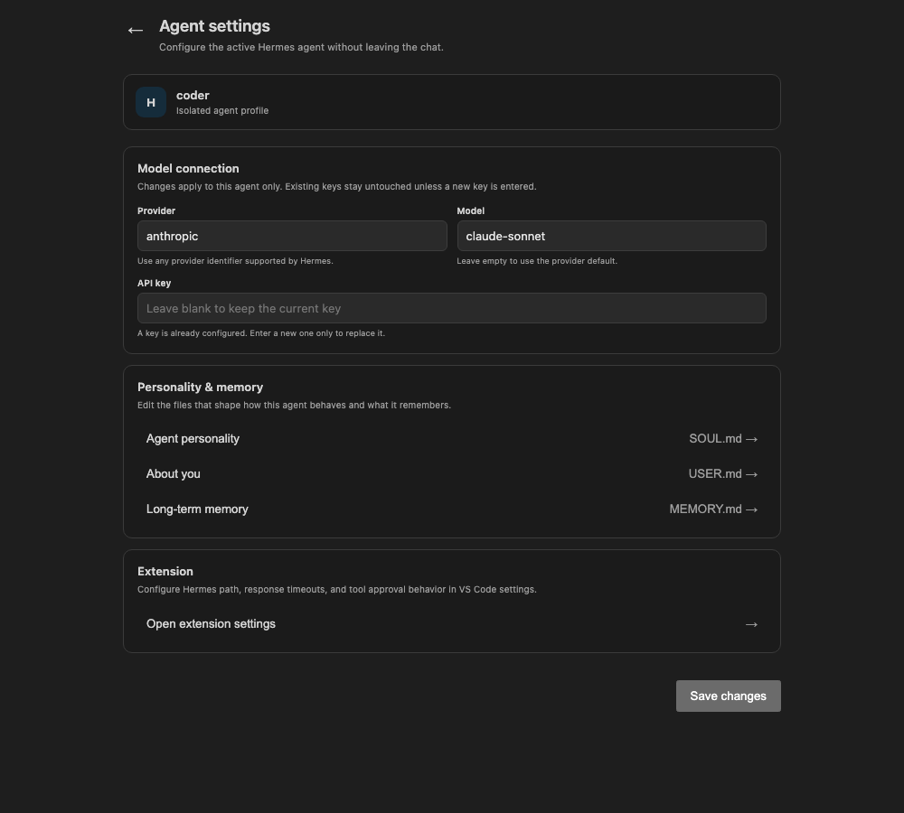

# Hermes Agent Chat for VS Code

Run persistent Hermes coding agents directly inside VS Code. Switch between isolated agent profiles, stream tool calls, attach workspace files, manage chat history, and configure each agent without leaving the editor.

Hermes Agent Chat connects to the local Hermes runtime through ACP. Each agent keeps its own model settings, personality, memory, session, and conversation history while sharing a focused VS Code-native chat experience.

## Screenshots



*Chat with a selected Hermes agent, attach workspace context, and follow streamed responses and tool activity in place.*



*Create a blank agent or clone an existing profile. Every agent gets isolated settings, memory, personality, and history.*



*Configure the active agent's provider, model, API key, personality, and memory without opening a terminal.*

## Highlights

- **Persistent multi-agent profiles** - Create and switch between isolated Hermes agents from the composer.
- **Streaming ACP chat** - Follow agent responses, reasoning, permission requests, and tool calls live.
- **Workspace context** - Automatically include the active editor selection or attach files from the workspace.
- **Per-agent settings** - Configure provider, model, and API key in an in-chat settings page.
- **Independent memory and history** - Keep sessions, personality, memory files, and chat history separate for every agent.
- **Safe tool permissions** - Review tool requests interactively or explicitly enable automatic approval.

## Features

| Capability | Included |
|------------|----------|
| Persistent isolated agents | Yes |
| Blank or cloned agent creation | Yes |
| Per-agent provider and model settings | Yes |
| Per-agent chat history and session resume | Yes |
| Streaming ACP responses | Yes |
| Tool call and permission visibility | Yes |
| Active file and selection context | Yes |
| Workspace file attachments | Yes |
| Personality and memory file access | Yes |
| Token usage tracking | Yes |

## Requirements

- [Hermes Agent](https://github.com/hermes-agent/hermes) installed and configured on your system.
- Run `hermes doctor` before using the extension to verify your local Hermes setup.

## Before You Install

This extension does not bundle Hermes Agent. It is a VS Code frontend for a local Hermes CLI installation, so your machine must already be able to run Hermes from a terminal.

Verify these commands before opening the extension:

```bash
hermes doctor
hermes version
hermes acp
```

If `hermes` is not on your `PATH`, set `hermes-chat.hermesPath` in VS Code to the full path of the Hermes executable.

Hermes remains the agent runtime. Common per-agent provider, model, and API key settings can be managed inside the extension; advanced tools, skills, MCP servers, and runtime behavior remain available through Hermes configuration.


## Getting Started

1. Install and configure Hermes Agent.
2. Run `hermes doctor` in a terminal.
3. Install this extension.
4. Click **Hermes Agent** in the Activity Bar.
5. Choose an agent, attach any relevant files, and send a message.

Hermes responds through the same agent pipeline you use from the CLI, including memory, tools, skills, and configured MCP servers.

## Need an API Key?

If you don't already have a model provider key, the setup wizard offers **Ace Data Cloud** — one key that works with 50+ models (GPT, Claude, Gemini, and more) through an OpenAI-compatible endpoint. Sign-up is free and comes with trial credits; after that it's pay-as-you-go with no subscription.

- In the setup wizard, pick **Ace Data Cloud** and paste your key, or
- Run **Hermes: Get API Key (Ace Data Cloud)** from the Command Palette to create an account.

You can use any other provider Hermes supports instead — Ace Data Cloud is just the quickest way to get a single key for many models.

## Tips

- Select code before asking a question to include that snippet as context.
- Use **Shift+Enter** for multi-line messages.
- Use the agent picker above the composer to switch profiles or create a new isolated agent.
- Open the gear menu to update the active agent without launching terminal setup.
- Use **New chat** to start a clean session while preserving earlier conversations in History.

## Extension Settings

| Setting | Default | Description |
|---------|---------|-------------|
| `hermes-chat.hermesPath` | `hermes` | Path to the Hermes CLI executable |
| `hermes-chat.timeout` | `30` | Timeout for short ACP control requests |
| `hermes-chat.streamIdleTimeout` | `120` | Maximum idle time between streamed response chunks |
| `hermes-chat.autoApproveTools` | `false` | Automatically approve tool permission requests; enable only when explicitly trusted |

## How It Works

This extension starts Hermes through `hermes acp` and communicates using JSON-RPC over ACP. Your messages go through Hermes's full agent pipeline, including tool use, memory, skills, cron jobs, and any configured MCP servers. The extension focuses on the VS Code experience; Hermes remains the agent runtime.

## Marketplace Positioning

Hermes Agent Chat is an AI and agent workflow extension. It is separate from telemetry frontends, spacecraft operations tools, and comment formatting extensions that may share the Hermes name.

## License

MIT
